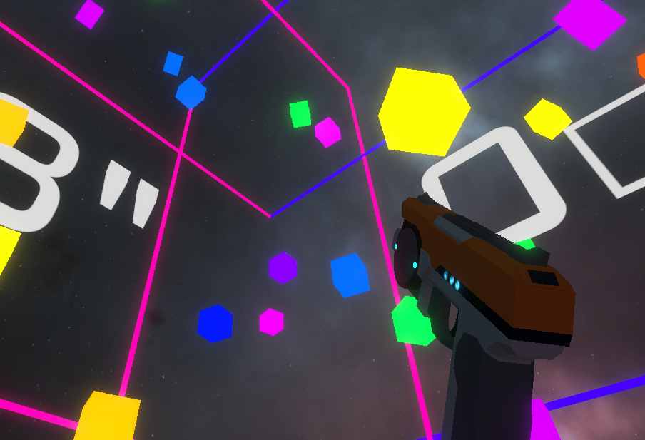
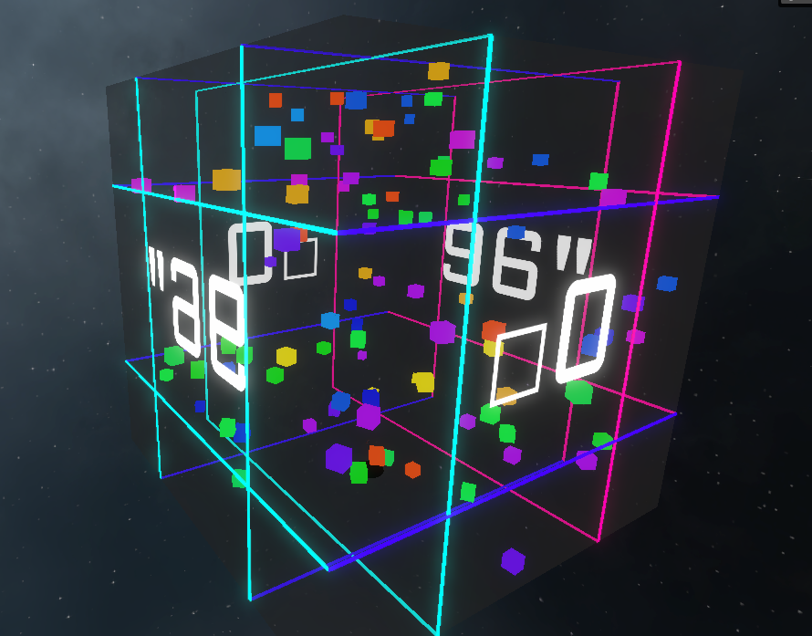

# CubesVRZenject 

This test was done in 3 days for a VR company, in the VR game, you have to shoot between 50-100 cubes.

* Used the **Zenject** framework to implement (and rush) some kind of DI design pattern.
* Used new **openXR plugin** to crossplatform **PCVR** and **Oculus**. (Not working with HTC Vive because I am using the pointerPosition input)
* Used **Resonance** from google for spatialization. I don't recommend using it anymore, it has been without support for years now.
* There is a lot of stuff that can be improved, or is unfinished. Such as a proper interaction system or a well defined architecture. It is a rushed test.

Already there are two built versions, an executable for win64 and an .apk for Oculus Quest, in the releases section.

Only the files inside the _Game folder are mine and open source.

